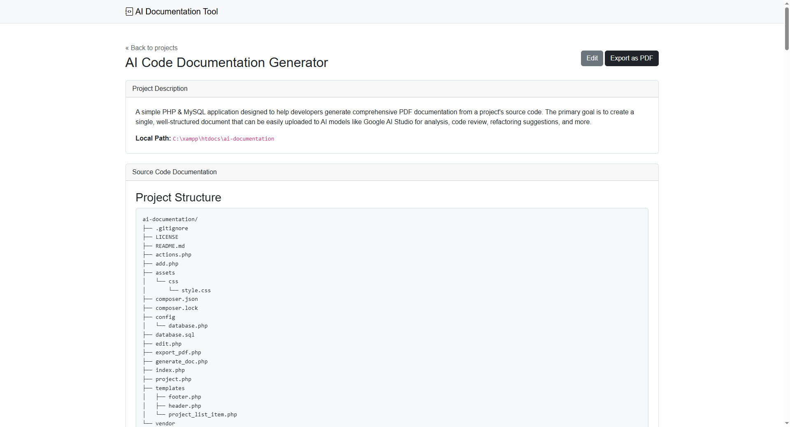

# AI Code Documentation Generator

**Current Version: 1.0**

A simple PHP & MySQL application designed to help developers generate comprehensive PDF documentation from a project's source code. The primary goal is to create a single, well-structured document that can be easily uploaded to AI models like **Google AI Studio** for analysis, code review, refactoring suggestions, and more.



## The Problem It Solves

Preparing a large codebase for analysis by an AI can be tedious. You often need to copy-paste dozens of files, losing the project's structure and context in the process. This tool automates that entire workflow by scanning a project directory and compiling everything into a single, clean, and context-rich PDF.

---

## Getting Started: A Beginner's Guide

This guide is for anyone, even if you have never used a local server before. We will walk through every step to get the application running on your Windows machine.

### Step 1: Install Your Local Server (XAMPP)

1.  **Download XAMPP**: Go to the official Apache Friends website: [https://www.apachefriends.org/index.html](https://www.apachefriends.org/index.html)
2.  **Run the Installer**: Follow the on-screen instructions. It's recommended to install it in the default path: `C:\xampp`.
3.  **Start Your Server**: Open the **XAMPP Control Panel** and start the **Apache** and **MySQL** services.

### Step 2: Install Composer (The PHP Package Manager)

1.  **Download Composer**: Go to the official download page: [https://getcomposer.org/download/](https://getcomposer.org/download/)
2.  **Run the Installer**: Open `Composer-Setup.exe` and follow the steps. It should automatically find your PHP installation inside XAMPP.

### Step 3: Get the Application Code

1.  **Download the Code**: Go to the GitHub repository page, click the green **"<> Code"** button, and choose **"Download ZIP"**.
2.  **Unzip the File**: Extract the contents of the ZIP file.
3.  **Rename and Move**:
    *   **Important**: Rename the extracted folder from `Code-to-PDF-for-AI-main` to `ai-documentation`.
    *   Move this `ai-documentation` folder inside XAMPP's web directory: `C:\xampp\htdocs\`.
    *   Your final project path should be `C:\xampp\htdocs\ai-documentation`.

### Step 4: Install Project Dependencies

1.  **Open Command Prompt (CMD)** in your project folder (`C:\xampp\htdocs\ai-documentation`).
2.  **Run Composer**: In the command prompt, type:
    ```bash
    composer install
    ```

### Step 5: Set Up the Database

**Part A: Create the Database Manually**
1.  **Open phpMyAdmin**: Go to `http://localhost/phpmyadmin` in your browser.
2.  **Create Database**: Click **"New"**, enter the name `ai_documentation`, choose `utf8mb4_unicode_ci` as collation, and click **"Create"**.

**Part B: Import the Table**
1.  **Select the Database**: Click on `ai_documentation` in the left sidebar.
2.  **Import**: Go to the **"Import"** tab, click **"Choose File"**, select `database.sql` from your project folder, and click **"Go"**.

---

## How to Use the Application

1.  **Access the Tool**: Go to `http://localhost/ai-documentation/`.
2.  **Add a Project**: Click **"New Project"**, fill in the title, description, and the full absolute path to the project folder.
3.  **Generate the PDF**: Click on a project's title, then click **"Export as PDF"**.

---

## Using the Generated PDF with an AI

Upload the generated PDF to an AI model like Google AI Studio and use prompts to analyze your code.

**Example Prompt for Security Analysis:**
> Act as a senior security analyst. Based on the provided project documentation, perform a thorough security audit. Identify any potential vulnerabilities, specify the file and line number, and provide a corrected code snippet.

---

## Author

**Stefan Iftimie**
*   **Company:** [Ahoi Digital SRL](https://www.ahoi.ro/)
*   **GitHub:** [@istefan](https://github.com/istefan)

---

## License

This project is licensed under the MIT License - see the `LICENSE` file for details.